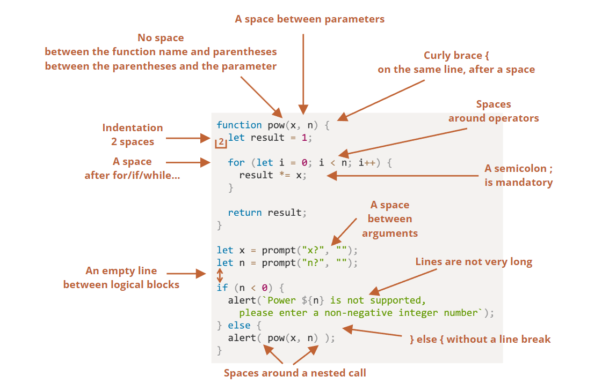

# 1
1. An Introduction to JavaScript
    * 1996, brendan eich of nescape published script editor, initially it 's called mocha, then livescript, finally javascipt
    * ECMAScript is a specification standard of client side languages such as: JScript (Microsoft), Javascript and it is recognized by ECMA International
    * Presently, we use ECMAScript 6 (ES6)
2. Manuals and specifications
    - Manual: MDN (Mozilla) JavaScript Reference
    - specification: It defines the language
        ECMAScript

3. Code editors
    - There are 2 main types of codeEditor: IDE and lightweight editor
    - IDE is also know as Integrated Development Environment: VS code
    - Lightweight editor: sublime text, vim, notepad
    The main different between IDE and lightweight editor is project level, IDE is powerful editor and it load much more project on start and analyzes project structure if needed but if load 1 file, lightweight editor is much faster and elegant & simple

4. Developer console: F12

# 2
1. Code structure
    - blocks of code = statement + semicolon + comment
2. The modern mode
    - "use strict"
4. Variable
    - only letter, digit, _ and $
    - the first character must not be a digit
    * Constant:
        - constants that are known prior to execution should use capital character
            + eg: COLOR_ORANGE 
        - constants that are calculated in run-time, during the execution should use normal character
            + eg: pageLoadTime 
5. Types:
   - Primitive: 
     + null
     + undefined
     + bollean
     + number
     + string
     + bigInt
     + symbol
    - Non-primitive: Object
- To check type: typeof
- Question: 
    + Null vs Undefined vs NaN:
        - Null: 
            * represents something that still not exist (include address and object)
            * In Math: Null = 0
            * (!Null == true)
        - Undefined:
            * defined type
            * initial value and still not assigned
            * (!Undefined == true)
        - NaN: 
            * represent something that is not number
            * is number (suprised)
            * (!NaN == true)
            * Using: isNaN()
    + BigInt vs number:
        - BigInt:
            * is integer
            * limited by available memory of the host system
        - number:
            * is decimal
            * limited by 64 bit 
    + Symbol:
        - A Symbol is a unique and used as the key of an Object property 

15. Functions
- Naming convention:
    + showMessage(..)     // shows a message
    + getAge(..)          // returns the age (gets it somehow)
    + calcSum(..)         // calculates a sum and returns the result
    + createForm(..)      // creates a form (and usually returns it)
    + checkPermission(..) // checks a permission, returns true/false
- 2 types: 
    + Function Declaration: If the function is declared as a separate statement in the main code flow
    + Function Expression is the function which defined by 1 expression through equal operator 
    + eg: 
        * let sayHi = function() {
            console.log('try')
        }
- The distinguish between Function Declaration vs Function Expression is:
    + Function Expression only can be created when it was called 
    + Function Declaration can be created earlier than it is defined
17. Arrow function:

* let sum = (a, b) => {  // the curly brace opens a multiline function
*   let result = a + b;
*   return result; // if we use curly braces, then we need an 
* explicit "return"
* };
* alert( sum(1, 2) ); // 3 

18. JS specials:
- Interact with browser:
    + prompt
    + confirm
    + alert
- Operators: 
    + Arithmetical:
        * (+, -, *, /, %-remainder, **)
        * eg: alert( 1 + '2' ); // '12', string
    + Assignments: 
        * a = 2
    + Bitwise
    + Conditional
        * cond ? resultA : resultB
    + logical
        * AND ( && ), OR ( || ), NOT ( ! )
    + Nullish coalescing operator
    + Comparisons:
        * ( ==, <=, >=, === )
- Functions: 
    + 3 ways to create a function:
        * function declaration
        * function expression
        * arrow function
    
# III Code Quality
2. Coding Style


- Curly brace: 
    + a code block (the last variant) is usually more readable
    ```js
    if (n < 0) {
      alert(`Power ${n} is not supported`);
    }
    ```
- Clean code: 
    + Should use if and return instead if/else  
```js
function pow(x, n) {
  if (n < 0) {
    alert("Negative 'n' not supported");
    return;
  }

  let result = 1;

  for (let i = 0; i < n; i++) {
    result *= x;
  }

  return result;
}
```
    + Should use function before declare it

```js
// the code which uses the functions
let elem = createElement();
setHandler(elem);
walkAround();

// --- helper functions ---
function createElement() {
  ...
}

function setHandler(elem) {
  ...
}

function walkAround() {
  ...
}
```
6. Transpiler && Polyfills
- Translate modern code to older code
- eg: 
    ```js
    const result = height ?? 100   // modern code

    const result = (( height != null) && (height != undefined)) ? height : 100 
    ```

- Polyfills: modern code has 1 new function, to run it in older code, we don't need to transpile, only polyfill by declare the missing function. 
    ```js
   
    if (!Math.trunc) { // if no such function
    // implement it
        Math.trunc = function(number) {
        // Math.ceil and Math.floor exist even in ancient JavaScript engines
    // they are covered later in the tutorial
            return number < 0 ? Math.ceil(number) : Math.floor(number);
        }
    }
    ```
# IV. Object: The basic
1. Object:
    - eg: 
        ```js
            let user = new Object(); // "object constructor" syntax
            let user = {};  // "object literal" syntax
        ```
    - Computed properties:
        + when creating an object with square brackets in an object literal

            ```js
            let fruit = prompt("Which fruit to buy?", "apple");         

            let bag = {
              [fruit]: 5, // the name of the property is taken from the             variable fruit
            };          

            alert( bag.apple ); // 5 if fruit="apple"
            ```
    - Property names limitations:
        + There are no limitations on property names
        + if property names have other types ( exclude string), which will be automatically converted to strings.
            * eg:   
                ```js
                let obj = {
                  0: "test" // same as "0": "test"
                };              

                // both alerts access the same property (the number 0 is                converted to string "0")
                alert( obj["0"] ); // test
                alert( obj[0] ); // test (same property)
                ```
    - Property existence: 
        + we have 3 ways to check: 
            * using undefined
                ```js
                let user = {};

                alert( user.noSuchProperty === undefined ); // true means "no such property"
                ```
            * using optional chain '?.'
            * using 'in' operator
                ```js
                let user = { age: 30 };

                let key = "age";
                alert( key in user ); // true, property "age" exists
                ```
    - We can use for ... in: 
        ```js
        let codes = {
          "49": "Germany",
          "41": "Switzerland",
          "44": "Great Britain",
          // ..,
          "1": "USA"
        };         

        for (let code in codes) {
          alert(code); // 1, 41, 44, 49 integer properties are sorted
        }
        ```


       
    