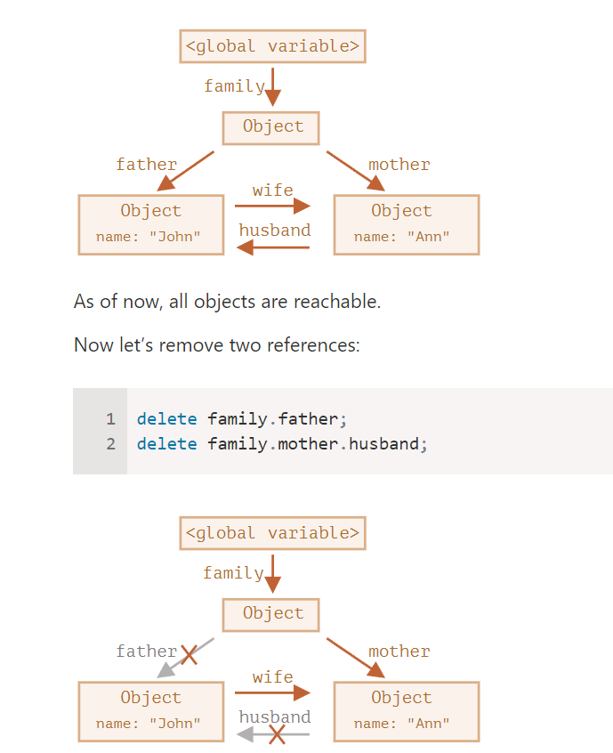
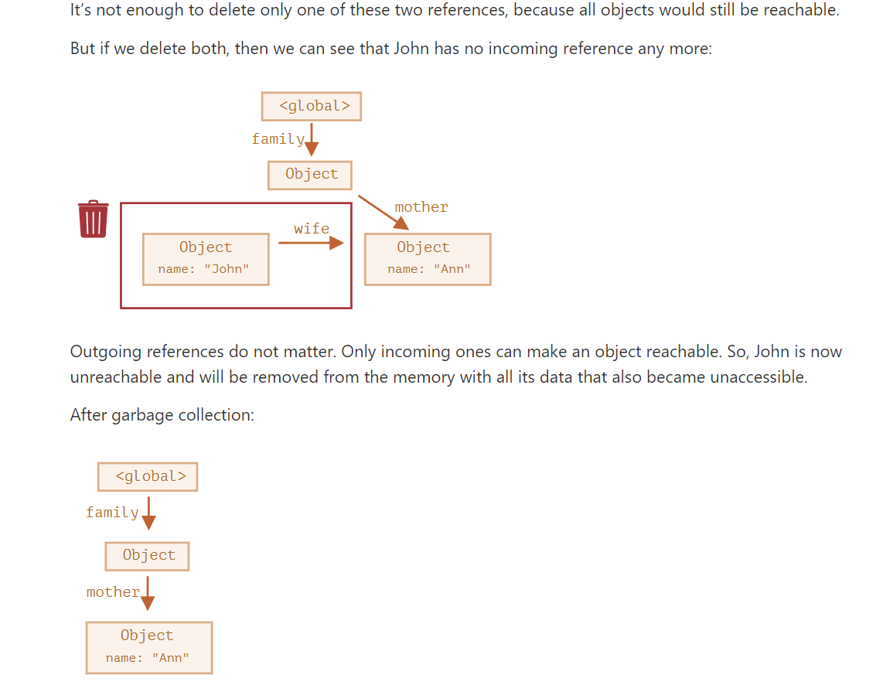

# 1
1. An Introduction to JavaScript
    * 1996, brendan eich of nescape published script editor, initially it 's called mocha, then livescript, finally javascipt
    * ECMAScript is a specification standard of client side languages such as: JScript (Microsoft), Javascript and it is recognized by ECMA International
    * Presently, we use ECMAScript 6 (ES6)
2. Manuals and specifications
    - Manual: MDN (Mozilla) JavaScript Reference
    - specification: It defines the language
        ECMAScript

3. Code editors
    - There are 2 main types of codeEditor: IDE and lightweight editor
    - IDE is also know as Integrated Development Environment: VS code
    - Lightweight editor: sublime text, vim, notepad
    The main different between IDE and lightweight editor is project level, IDE is powerful editor and it load much more project on start and analyzes project structure if needed but if load 1 file, lightweight editor is much faster and elegant & simple

4. Developer console: F12

# 2
1. Code structure
    - blocks of code = statement + semicolon + comment
2. The modern mode
    - "use strict"
4. Variable
    - only letter, digit, _ and $
    - the first character must not be a digit
    * Constant:
        - constants that are known prior to execution should use capital character
            + eg: COLOR_ORANGE 
        - constants that are calculated in run-time, during the execution should use normal character
            + eg: pageLoadTime 
5. Types:
   - Primitive: 
     + null
     + undefined
     + bollean
     + number
     + string
     + bigInt
     + symbol
    - Non-primitive: Object
- To check type: typeof
- Question: 
    + Null vs Undefined vs NaN:
        - Null: 
            * represents something that still not exist (include address and object)
            * In Math: Null = 0
            * (!Null == true)
        - Undefined:
            * defined type
            * initial value and still not assigned
            * (!Undefined == true)
        - NaN: 
            * represent something that is not number
            * is number (suprised)
            * (!NaN == true)
            * Using: isNaN()
    + BigInt vs number:
        - BigInt:
            * is integer
            * limited by available memory of the host system
        - number:
            * is decimal
            * limited by 64 bit 
    + Symbol:
        - A Symbol is a unique and used as the key of an Object property 

15. Functions
- Naming convention:
    + showMessage(..)     // shows a message
    + getAge(..)          // returns the age (gets it somehow)
    + calcSum(..)         // calculates a sum and returns the result
    + createForm(..)      // creates a form (and usually returns it)
    + checkPermission(..) // checks a permission, returns true/false
- 2 types: 
    + Function Declaration: If the function is declared as a separate statement in the main code flow
    + Function Expression is the function which defined by 1 expression through equal operator 
    + eg: 
        * let sayHi = function() {
            console.log('try')
        }
- The distinguish between Function Declaration vs Function Expression is:
    + Function Expression only can be created when it was called 
    + Function Declaration can be created earlier than it is defined
17. Arrow function:

* let sum = (a, b) => {  // the curly brace opens a multiline function
*   let result = a + b;
*   return result; // if we use curly braces, then we need an 
* explicit "return"
* };
* alert( sum(1, 2) ); // 3 

18. JS specials:
- Interact with browser:
    + prompt
    + confirm
    + alert
- Operators: 
    + Arithmetical:
        * (+, -, *, /, %-remainder, **)
        * eg: alert( 1 + '2' ); // '12', string
    + Assignments: 
        * a = 2
    + Bitwise
    + Conditional
        * cond ? resultA : resultB
    + logical
        * AND ( && ), OR ( || ), NOT ( ! )
    + Nullish coalescing operator
    + Comparisons:
        * ( ==, <=, >=, === )
- Functions: 
    + 3 ways to create a function:
        * function declaration
        * function expression
        * arrow function
    
# III Code Quality
2. Coding Style


- Curly brace: 
    + a code block (the last variant) is usually more readable
    ```js
    if (n < 0) {
      alert(`Power ${n} is not supported`);
    }
    ```
- Clean code: 
    + Should use if and return instead if/else  
```js
function pow(x, n) {
  if (n < 0) {
    alert("Negative 'n' not supported");
    return;
  }

  let result = 1;

  for (let i = 0; i < n; i++) {
    result *= x;
  }

  return result;
}
```
    + Should use function before declare it

```js
// the code which uses the functions
let elem = createElement();
setHandler(elem);
walkAround();

// --- helper functions ---
function createElement() {
  ...
}

function setHandler(elem) {
  ...
}

function walkAround() {
  ...
}
```
6. Transpiler && Polyfills
- Translate modern code to older code
- eg: 
    ```js
    const result = height ?? 100   // modern code

    const result = (( height != null) && (height != undefined)) ? height : 100 
    ```

- Polyfills: modern code has 1 new function, to run it in older code, we don't need to transpile, only polyfill by declare the missing function. 
    ```js
   
    if (!Math.trunc) { // if no such function
    // implement it
        Math.trunc = function(number) {
        // Math.ceil and Math.floor exist even in ancient JavaScript engines
    // they are covered later in the tutorial
            return number < 0 ? Math.ceil(number) : Math.floor(number);
        }
    }
    ```
# IV. Object: The basic
1. Object:
    - eg: 
        ```js
            let user = new Object(); // "object constructor" syntax
            let user = {};  // "object literal" syntax
        ```
    - Computed properties:
        + when creating an object with square brackets in an object literal

            ```js
            let fruit = prompt("Which fruit to buy?", "apple");         

            let bag = {
              [fruit]: 5, // the name of the property is taken from the             variable fruit
            };          

            alert( bag.apple ); // 5 if fruit="apple"
            ```
    - Property names limitations:
        + There are no limitations on property names
        + if property names have other types ( exclude string), which will be automatically converted to strings.
            * eg:   
                ```js
                let obj = {
                  0: "test" // same as "0": "test"
                };              

                // both alerts access the same property (the number 0 is                converted to string "0")
                alert( obj["0"] ); // test
                alert( obj[0] ); // test (same property)
                ```
    - Property existence: 
        + we have 3 ways to check: 
            * using undefined
                ```js
                let user = {};

                alert( user.noSuchProperty === undefined ); // true means "no such property"
                ```
            * using optional chain '?.'
            * using 'in' operator
                ```js
                let user = { age: 30 };

                let key = "age";
                alert( key in user ); // true, property "age" exists
                ```
    - We can use for ... in: 
        ```js
        let codes = {
          "49": "Germany",
          "41": "Switzerland",
          "44": "Great Britain",
          // ..,
          "1": "USA"
        };         

        for (let code in codes) {
          alert(code); // 1, 41, 44, 49 integer properties are sorted
        }
        ```
2. Object Reference and copying
    - Primitive values: strings, numbers, booleans, etc – are always copied “as a whole value”
    - Object values: reference the same address
        * eg:

            ```js
             let user = { name: 'John' };

             let admin = user;           

             admin.name = 'Pete'; // changed by the "admin"                reference            

             alert(user.name); // 'Pete', changes are seen from the        "user"         reference
            ```


            ```js
            let a = {};
            let b = a; // copy the reference            

            alert( a == b ); // true, both variables reference the same object
            alert( a === b ); // true
            ```
    - Replicate object: 
        + Using for...in:
            ```js
            let user = {
              name: "John",
              age: 30
            };          

            let clone = {}; // the new empty object         

            // let's copy all user properties into it
            for (let key in user) {
              clone[key] = user[key];
            }           

            // now clone is a fully independent object with the same content
            clone.name = "Pete"; // changed the data in it          

            alert( user.name ); // still John in the original object
            ```
        + Using assign:
            ```js
            let user = { name: "John" };

            let permissions1 = { canView: true };
            let permissions2 = { canEdit: true };           

            // copies all properties from permissions1 and permissions2             into user
            Object.assign(user, permissions1, permissions2);            

            // now user = { name: "John", canView: true, canEdit: true }
            ```
        + Const objects can be modified
            ```js
            const user = {
              name: "John"
            };          

            user.name = "Pete"; // (*)          

            alert(user.name); // Pete
            ```
3. Garbage collection:
- Garbage collection is performed automatically. We cannot force or prevent it.
- Objects are retained in memory while they are reachable.
- Being referenced is not the same as being reachable (from a root): a pack of interlinked objects can become unreachable as a whole, as we’ve seen in the example above.

    ```js
    function marry(man, woman) {
      woman.husband = man;
      man.wife = woman;    

      return {
        father: man,
        mother: woman
      }
    }      

    let family = marry({
      name: "John"
    }, {
      name: "Ann"
    });
    ```
       
    
    

4. Object methods, "this"
- “this” is not bound
In JavaScript, keyword this behaves unlike most other programming languages. It can be used in any function, even if it’s not a method of an object.
    ```js
    function sayHi() {
      alert( this.name );
    }
    ```
- Arrow functions have no “this”. When this is accessed inside an arrow function, it is taken from outside.
- Remember: 
    + When a function is declared, it may use this, but that this has no value until the function is called.
    + A function can be copied between objects.
    + When a function is called in the “method” syntax: object.method(), the value of this during the call is object.
- eg:  
    ```js
    function makeUser() {
      return {
        name: "John",
        ref: this
      };
    }      

    let user = makeUser();     

    alert( user.ref.name ); // Error: Cannot read property     'name' of undefined
    ```
- Here the value of this inside makeUser() is undefined, because it is called as a function, not as a method with “dot” syntax.
    ```js
    function makeUser() {
      return {
        name: "John",
        ref() {
          return this;
        }
      };
    }       

    let user = makeUser();      

    alert( user.ref().name ); // John
    ```
- Now it works, because user.ref() is a method. And the value of this is set to the object before dot ..

- A JavaScript function is a block of code designed to perform a particular task. The javascript method is an object property that has a function value. A function can pass the data that is operated and may return the data. The method operates the data contained in a Class

5. Constructor Function, operator "new"
- They are named with capital letter first.
- They should be executed only with "new" operator.
- When a function is executed with new, it does the following steps:
    + A new empty object is created and assigned to this.
    + The function body executes. Usually it modifies this, adds new properties to it.
    + The value of this is returned.
    ```js
        function User(name) {
      // this = {};  (implicitly)   

      // add properties to this
      this.name = name;
      this.isAdmin = false; 

      // return this;  (implicitly)
    }
    ```
- Let’s note once again – technically, any function (except arrow functions, as they don’t have this) can be used as a constructor

- Constructor mode test: new.target
    + Inside a function, we can check whether it was called with new or without it, using a special new.target property.
    ```js
            function User(name) {
          if (!new.target) { // if you run me without       new
            return new User(name); // ...I will add         new for you
          }     

          this.name = name;
        }       

        let john = User("John"); // redirects call to       new User
        alert(john.name); // John
    ```
- Return from constructors
    + Usually, constructors do not have a return statement. Their task is to write all necessary stuff into this, and it automatically becomes the result.
    + If return is called with an object, then the object is returned instead of this.For instance, here return overrides this by returning an object:
        ```js
                function BigUser() {        

          this.name = "John";       

          return { name: "Godzilla" };  // <--      returns this object
        }       

        alert( new BigUser().name );  // Godzilla,      got that object
        ```
    + If return is called with a primitive, it’s ignored.
        ```js
                function SmallUser() {      

          this.name = "John";       

          return; // <-- returns this
        }       

        alert( new SmallUser().name );  // John
        ```
- By the way, we can omit parentheses after new, if it has no arguments:

    ```js
            let user = new User; // <-- no parentheses
        // same as
        let user = new User();
    ```
6. Optional chaining
  - The optional chaining ?. syntax has three forms:    

    + obj?.prop – returns obj.prop if obj exists, otherwise undefined.
    + obj?.[prop] – returns obj[prop] if obj exists, otherwise undefined.
    + obj.method?.() – calls obj.method() if obj. method exists, otherwise returns undefined.
  - The optional chaining ?. stops the evaluation if the value before ?. is undefined or null and returns undefined.
  - other variant: ?.(), ?.[]
    ```js
    let userAdmin = {
      admin() {
        alert("I am admin");
      }
    };    

    let userGuest = {};   

    userAdmin.admin?.(); // I am admin    

    userGuest.admin?.(); // nothing happens (no such    method)
    ```

    ```js
    let key = "firstName";     

    let user1 = {
      firstName: "John"
    };     

    let user2 = null;    

    alert( user1?.[key] ); // John
    alert( user2?.[key] ); // undefined
    ```


  7. Symbol 
  - By specification, only two primitive types may serve as object property keys: string type, or symbol type.
  - Symbols are guaranteed to be unique. Even if we create many symbols with exactly the same description, they are different values. The description is just a label that doesn’t affect anything.
    + eg: 
      ```js
      let id1 = Symbol("id");
      let id2 = Symbol("id");     

      alert(id1 == id2); // false
      ```
  - What’s the benefit of using Symbol("id") over a string "id"?

    + As user objects belong to another codebase, it’s    unsafe to add fields to them, since we might    affect pre-defined behavior in that other    codebase. However, symbols cannot be accessed    accidentally. The third-party code won’t be    aware of newly defined symbols, so it’s safe to    add symbols to the user objects.
      * eg: 
        ```js
        let user = { // belongs to another code
          name: "John"
        };        

        let id = Symbol("id");        

        user[id] = 1;       

        alert( user[id] ); // we can access the data        using the symbol as the key
        ```

  - Symbols in an object literal:
    ```js
      let id = Symbol("id");
      const x = {
          name: 'h',
          [id]: 123
      }     

      console.log(x)  
    ```

  - Symbols are ignore by for…in and Object.keys but work in Object.assign

  - In order to read (create if absent) a symbol from the registry, use Symbol.for(key).

    + That call checks the global     registry, and if there’s a symbol     described as key, then returns it,    otherwise creates a new symbol Symbol   (key) and stores it in the registry    by the given key.
      ```js
      // read from the global registry
      let id = Symbol.for("id"); // if the      symbol did not exist, it is created     

      // read it again (maybe from another      part of the code)
      let idAgain = Symbol.for("id");     

      // the same symbol
      alert( id === idAgain ); // true
      ```

  - Symbol.for(key) and Symbol.keyFor(sym)
  - Symbols have two main use cases:

    + “Hidden” object properties, it won’t be accidentally processed together with other properties. Also it won’t be accessed directly (eg: for...in, object.keys)

    + There are many system symbols used by JavaScript which are accessible as Symbol.*. We can use them to alter some built-in behaviors
  - Technically, symbols are not 100% hidden. There is a built-in method Object.getOwnPropertySymbols(obj) that allows us to get all symbols. Also there is a method named Reflect.ownKeys(obj) that returns all keys of an object including symbolic ones

  8. object-to-primitive
  - The object-to-primitive conversion is called automatically by many built-in functions and operators that expect a primitive as a value.

  - There are 3 types (hints) of it:

    + "string" (for alert and other operations that need a string)
    + "number" (for maths)
    + "default" (few operators, usually objects implement it the same way as "number")
    + The specification describes explicitly which operator uses which hint.

 - The conversion algorithm is:

    + Call obj[Symbol.toPrimitive](hint) if the method exists,
    + Otherwise if hint is "string"
       try calling obj.toString() or obj.valueOf(), whatever exists.
    + Otherwise if hint is "number" or "default"
       try calling obj.valueOf() or obj.toString(), whatever exists.
    + All these methods must return a primitive to work (if defined).

    # V. Data types
1. Methods of primitives: 
    - One of the best things about objects is that we can store a function as one of its properties
        ```js
            let john = {
              name: "John",
              sayHi: function() {
                alert("Hi buddy!");
              }
            };          

            john.sayHi(); // Hi buddy!
        ```
    - A primitive as an object
       + The “object wrappers” are different for each primitive type and are called: String, Number, Boolean, Symbol and BigInt. Thus, they provide different sets of methods.
       ```js
       let str = "Hello";

        alert( str.toUpperCase() ); // HELLO
       ```
       + Note: should not use new when instantiate object
            ```js
                alert( typeof 0 ); // "number"

                alert( typeof new Number(0) ); // "object"!

                let num = Number("123"); // convert a string to number

            ``` 
        + null/undefined have no methods